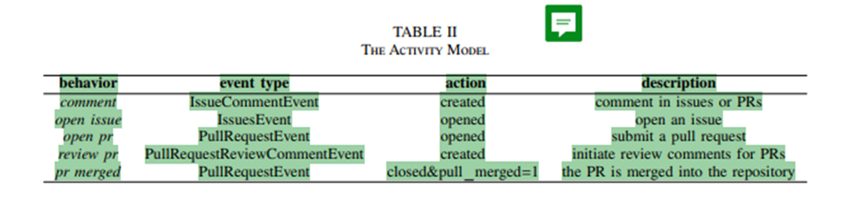

# Skrypt github.py
Skrypt służy do pobierania danych o aktywności wskazanej organizacji lub listy repozytoriów z pliku tekstowego, wykorzystując GITHUB REST API. 
Flow:
1. Iteracja przez repozytoria i pobranie ich metadanych
2. Pobranie eventów (issues, prs, comments)
3. Przekształcenie danych do płaskiego formatu JSON (GHArchive-like JSONEachRow)
4. Zapis do skompresowanego pliku .json.gz

### Badane typy aktywności

### Zmienne konfiguracyjne
- ORG_NAME: nazwa organizacji GitHub do przeskanowania
- OUTPUT_FILE: nazwa pliku wyjściowego
- STOP_DATE: skrypt nie pobiera danych starszych niż ta data
- REPO_NUMBER_LIMIT: limit liczby repozytoriów do pobrania
- REQUEST_TIMEOUT: maksymalny czas oczekiwania na odpowiedź API

### Użyte endpointy

|                  Nazwa eventu | Endpoint API     | Warunek pobierania | Opis                                                                                    |
|------------------------------:|------------------|:------------------:|:----------------------------------------------------------------------------------------|
|             IssueCommentEvent | /issues/comments |    sort=created    | wszystkie komentarze w issues i PR                                                      |
|                   IssuesEvent | /issues          |     state=all      | otwarte zgłoszenia                                                                      |
|        PullRequestEvent(open) | /pulls           |     state=all      | otwarte pull requesty                                                                   |
|       PullRequestEvent(merge) | /pulls           |    state=closed    | sprawdza pole merged_at i jeśli istnieje to generuje event closed z flagą pull_merged=1 |
| PullRequestReviewCommentEvent | /pulls/comments  |    sort=created    | komentarze do kodu (code review)                                                        |

### Obsługa rate limits
- primary limit (403): sprawdzenie nagłówka X-RateLimit-Remaining. Jeśli 0, skrypt czeka do czasu wskazanego w X-RateLimit-Reset + 5 sekund
- secondary limit (403/429): obsługuje nagłówek Retry-After
- backoff: dla innych błędów wydłużenie czasu oczekiwania

### Model danych wyjściowych 
Plik wynikowy zawiera po jednym obiekcie JSON w każdej linii (format JSONEachRow). 

`{
  "id": "typ_zdarzenia:id_obiektu",
  "type": "NazwaZdarzenia",          
  "created_at": "ISO-8601 Timestamp",
  "actor": "{...}",                
  "repo": "{...}",              
  "org": "{...}",                 
  "payload": "{...}"               
}`
### Załadowanie danych
Wynikowy plik jest gotowy do załadowania do bazy Clickhouse przy pomocy skryptu insert_file.sql

### Anonimizacja danych
Dane kluczowe dla analizy (nie wolno modyfikować):
- created_at, merged_at
- type
- payload.action
- payload.pull_request.merged

Dane, które nie są analizowane:
- treści body i title (tytuły, treści komentarzy etc)
- linki url 
- szczegóły git: commit_id, etc
- emaile

Dane do zahashowania:
- actor.login
- actor.id
- repo.name